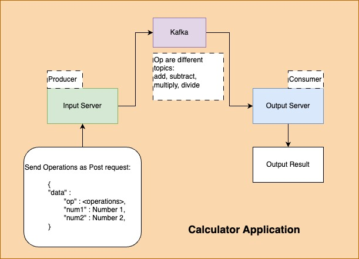
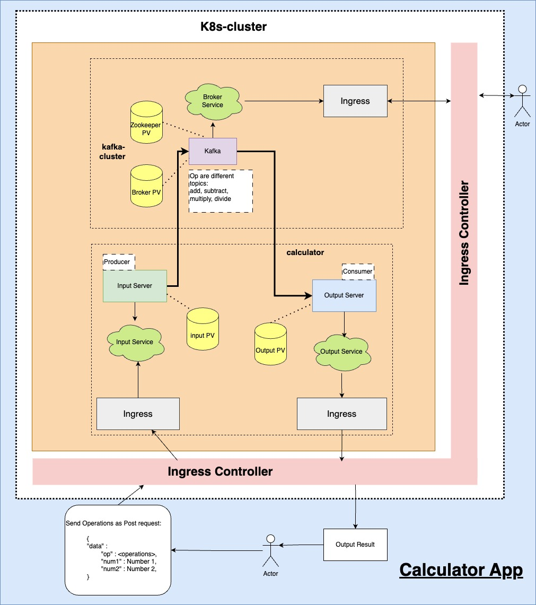

# Demo Applications :

1. **Sample App** : simple hello World nodejs express app that listens at port 3000.
2. **Calculator App** : A simple calculator app with 2 services `input-service` & `output-service`.
    - `input-service` : listens at port 9000 and accepts post request at `/input` with payload of {"op":"add","num1":100,"num2":12}
    - `output-service` : listens at port 90001 and accepts get request at `/` to give latest calculation operation.
    - They both communicate via locally hosted kafka. 
    - Different `operations` are different kafka topics which get created and messages are sent and read from them accordingly.
    - Both services listen to get request `/kill` to forcefully terminate the service.

**TODO :** Change ROOT_PATH appropriately

## Docker-compose setup :

## K8s setup :

